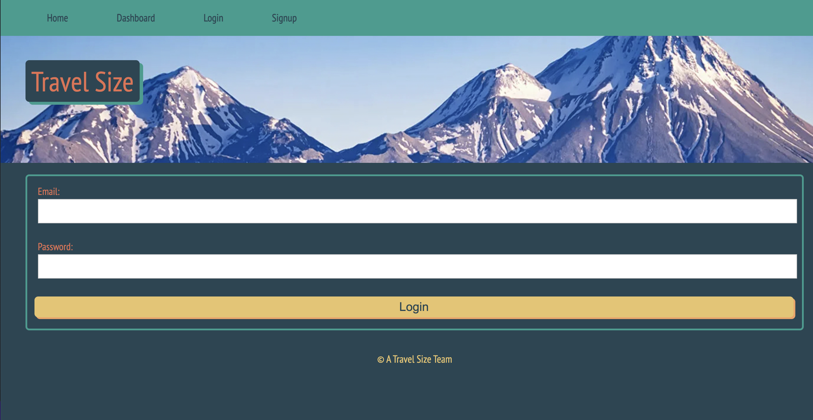
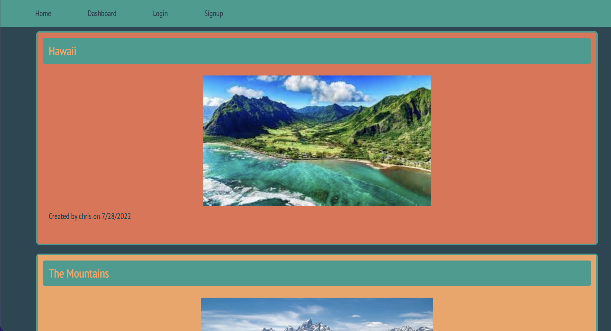
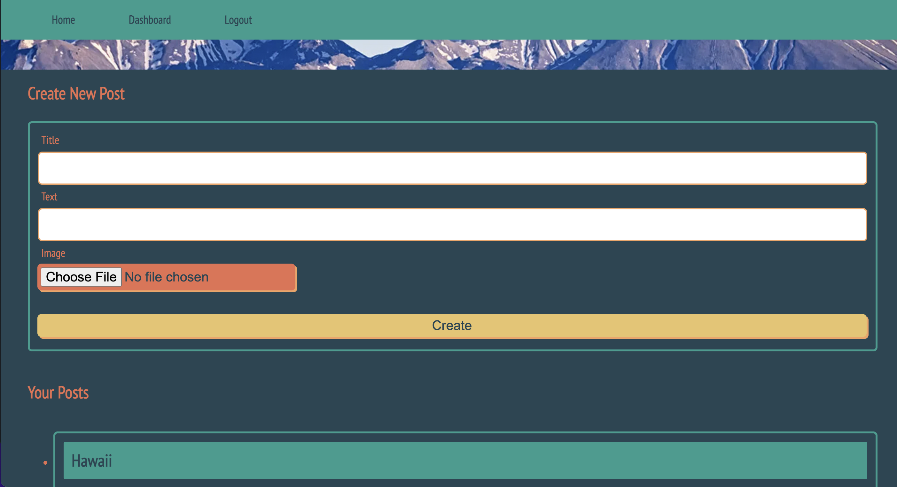
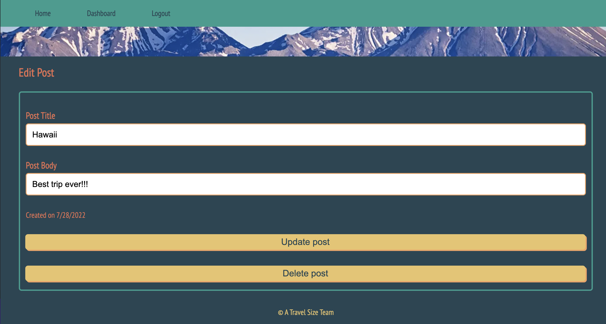

# Travel Size

## Table of Contents

1. [Description](#description)
2. [Images](#images)
3. [Installation](#installation)
4. [Usage](#usage)
5. [License](#license)
6. [Contributors](#conttributors)

## Description

Travel Size is an app for travel enthusiasts. When you want to travel but don’t know anyone who has been there, this site allows you to read about other people’s experiences as well as create your own to help others looking for the same information. Just make an account to enjoy the benefits of this we app. Employs bcrypt and password hashing to safeguard user informaiton. Through the use of Cloudinary SaaS user can upload and store images in our database.

## Images

Login page

 
Homepage 

 
Dashboard

 
Edit/Delete Posts

 

## Installation

No installation necessary for users, open the app url and start enjoying the app. For developers, fork repository from github, download locally and run 'npm install' in terminal to install all necessary dependencies

## Usage

To use application, open the app's url. If you are a new user, sign up using an email, and create your username and password. If you are a previous user select log in and add your credentials. Once logged in you can view, add and edit posts.

## License

Distributed under **ISC**. See [License](https://spdx.org/licenses/ISC.html) for more information.

ISC License

Permission to use, copy, modify, and/or distribute this software for any purpose with or without fee is hereby granted, provided that the above copyright notice and this permission notice appear in all copies.

THE SOFTWARE IS PROVIDED "AS IS" AND THE AUTHOR DISCLAIMS ALL WARRANTIES WITH REGARD TO THIS SOFTWARE INCLUDING ALL IMPLIED WARRANTIES OF MERCHANTABILITY AND FITNESS. IN NO EVENT SHALL THE AUTHOR BE LIABLE FOR ANY SPECIAL, DIRECT, INDIRECT, OR CONSEQUENTIAL DAMAGES OR ANY DAMAGES WHATSOEVER RESULTING FROM LOSS OF USE, DATA OR PROFITS, WHETHER IN AN ACTION OF CONTRACT, NEGLIGENCE OR OTHER TORTIOUS ACTION, ARISING OUT OF OR IN CONNECTION WITH THE USE OR PERFORMANCE OF THIS SOFTWARE.

## Badges

## How to Contribute

To contribute to this application, make sure to fork the repository and clone it to your computer. Email me with any questions or any ideas about possible contributions. Then create a pull request for your code to be reviewed before being merged to the application.

## Tests

Tests for helper functions provided. Test using Jest npm in command line.

## Contributors

1. Chris Hodges
2. Jorge Monteagudo
3. Craig Hyman
4. Colin Alexander

**GitHub Repository:** https://github.com/jorge30fm/Travel-Size-

**App url:** <https://dry-refuge-26643.herokuapp.com/>

